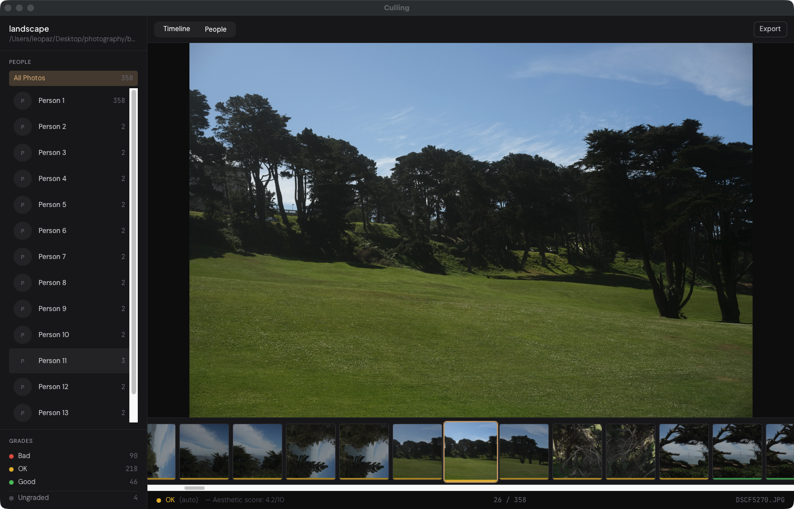
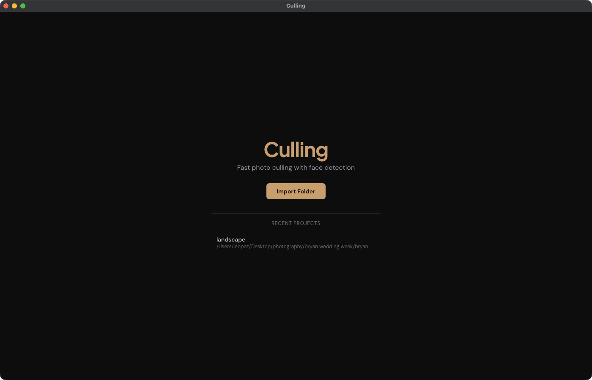
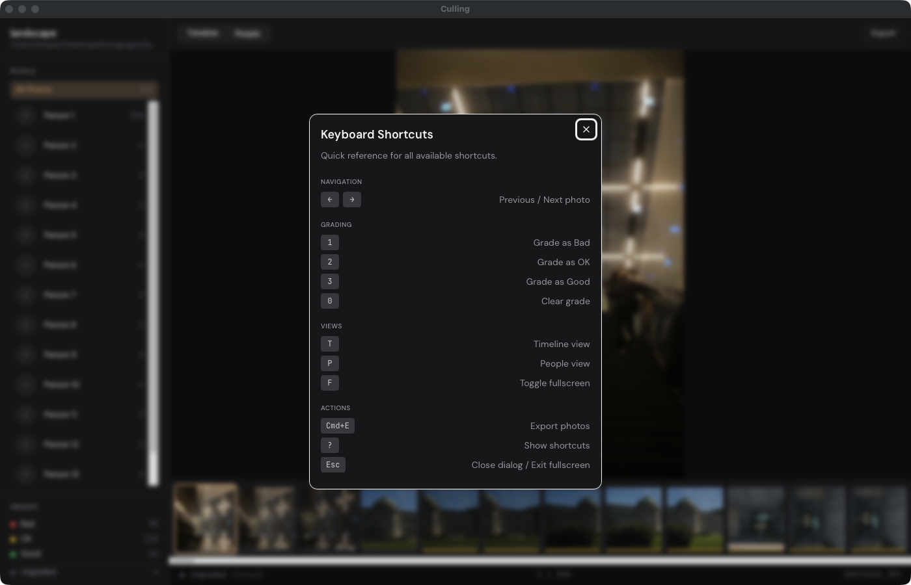
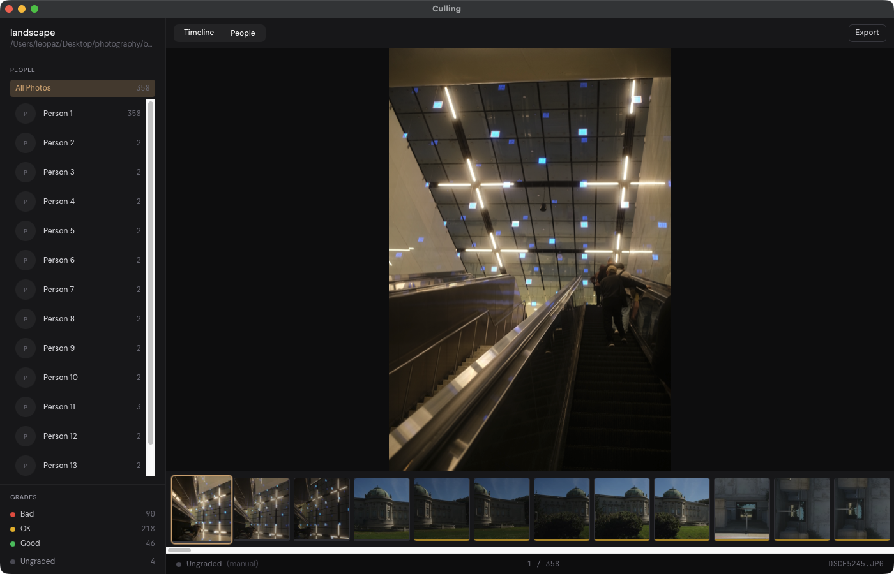
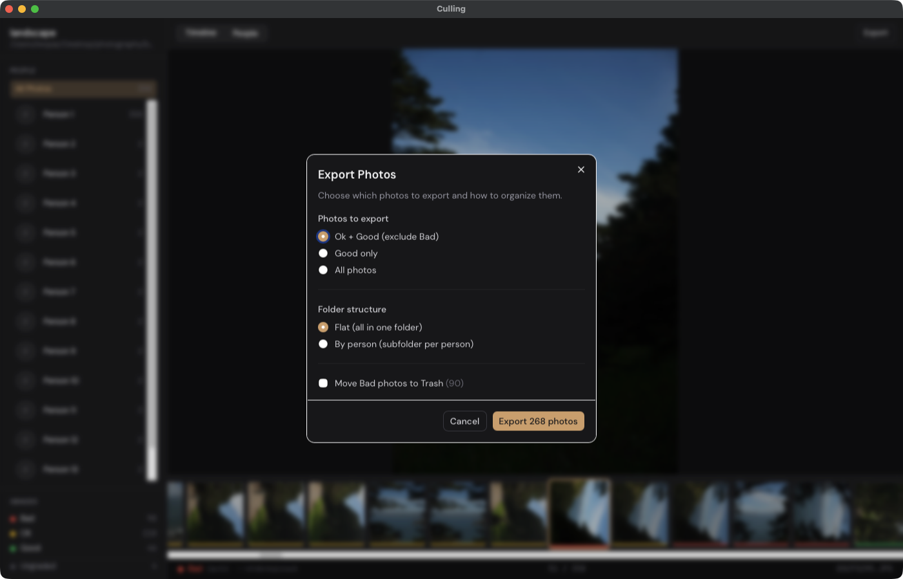

# Culling

Fast, keyboard-driven photo culling with automatic face detection and aesthetic grading.



## What It Does

Culling helps photographers quickly sort through large photo shoots. Import a folder of photos and the app automatically:

- **Grades every photo** using sharpness analysis and a neural aesthetic scorer (NIMA)
- **Detects and clusters faces** so you can browse by person
- **Organizes exports** by grade, person, or both

Override any auto-grade with a single keystroke. Export your picks when done.

## Screenshots

| Welcome | Keyboard Shortcuts |
|---------|-------------------|
|  |  |

| People View | Export Dialog |
|-------------|-------------|
|  |  |

## Keyboard Shortcuts

| Key | Action |
|-----|--------|
| `←` `→` | Previous / Next photo |
| `1` `2` `3` | Grade as Bad / OK / Good |
| `0` | Clear grade |
| `T` | Timeline view |
| `P` | People view |
| `F` | Toggle fullscreen |
| `Cmd+E` | Export photos |
| `Cmd+R` | Rescan folder |
| `?` | Show all shortcuts |

## Features

- **Auto-grading** -- Heuristic checks (sharpness, exposure) + NIMA aesthetic scoring on a 0-10 scale
- **Face detection** -- SCRFD detector + ArcFace embeddings clustered with DBSCAN
- **People view** -- Browse photos grouped by detected person, plus virtual "Groups" and "Landscapes" categories
- **Incremental processing** -- Only processes new/changed photos on rescan
- **Export options** -- Filter by grade, organize flat or by person, optionally trash bad photos
- **Crash recovery** -- Progress saved every 5 photos during enrichment

## Tech Stack

| Layer | Technology |
|-------|-----------|
| Desktop shell | Tauri v2 |
| Frontend | Svelte 5 + SvelteKit + Tailwind CSS v4 |
| Backend | Rust (tokio, serde, image, nalgebra) |
| ML inference | ONNX Runtime via `ort` |
| Face detection | InsightFace buffalo_l (SCRFD + ArcFace) |
| Aesthetic scoring | NIMA |

## Getting Started

### Prerequisites

- [Node.js](https://nodejs.org/) 18+
- [Rust](https://rustup.rs/) (latest stable)
- Tauri v2 CLI: `npm install -g @tauri-apps/cli`

### Development

```bash
npm install
npm run tauri dev
```

On first launch, the app downloads ~200 MB of ONNX models (face detector, face embedder, aesthetic scorer) to `~/.culling/models/`.

### Build

```bash
npm run tauri build
```

## Data Storage

All data lives in `~/.culling/`:

```
~/.culling/
├── config.json          # Tunable thresholds
├── projects/            # Project state (grades, clusters, metadata)
├── models/              # ONNX models (auto-downloaded)
├── thumbnails/          # 300px cached thumbnails
└── working/             # 1280px working copies for detection
```

## License

MIT
